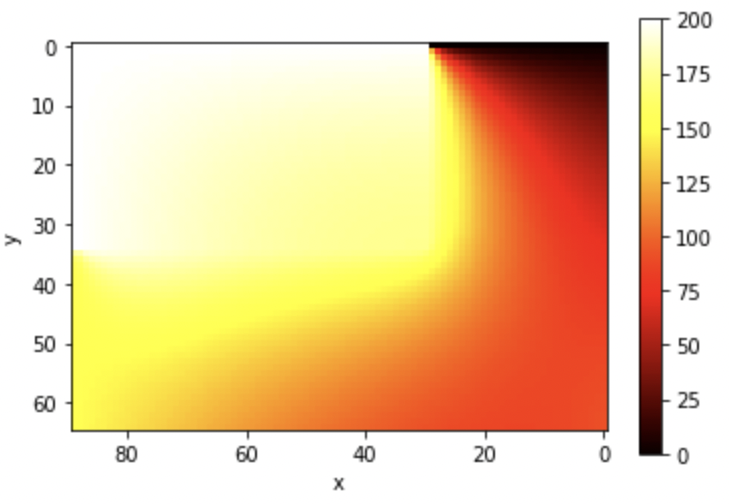
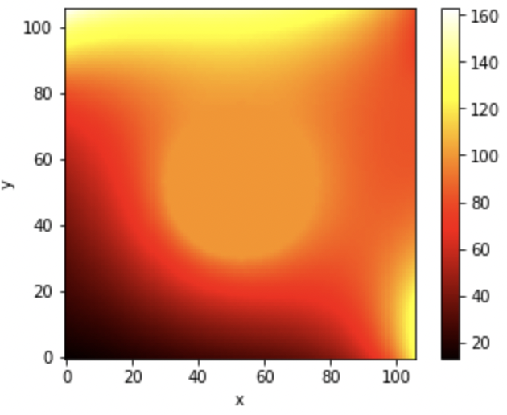
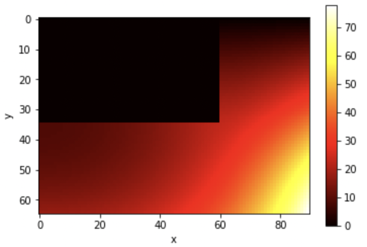
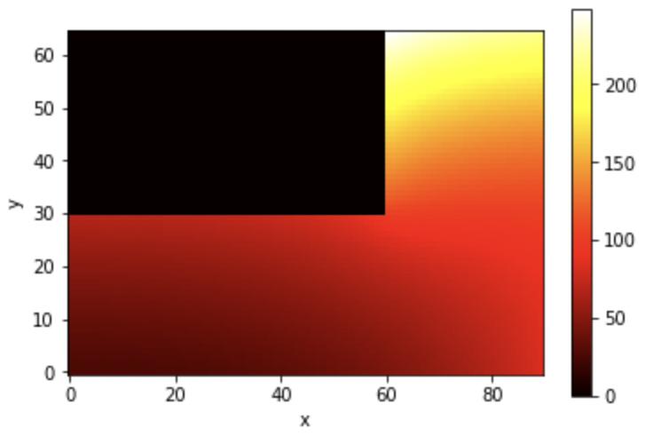
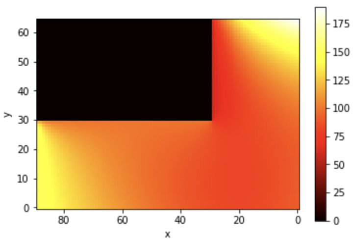
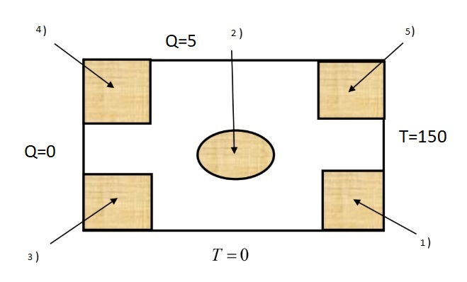
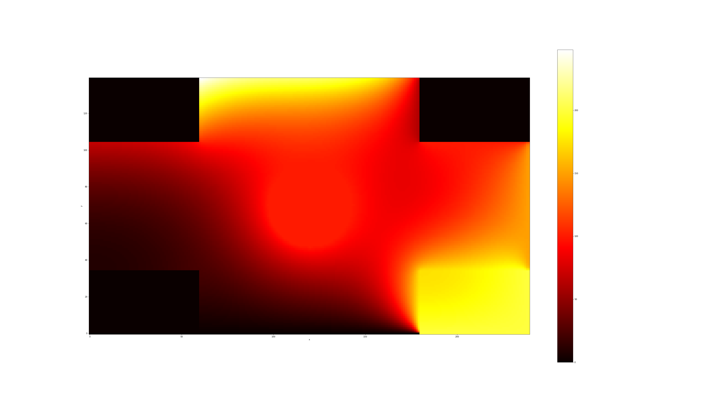

# 2D Heat Equation modelling
Modelling solution of 2D heat equation with different border conditions

<figure>
  <figtitle>1) Constant temperature on outer borders of the region adjacent to the outer boundary</figtitle>
  
</figure>

<figure>
  <figtitle>2) Constant temperature on borders of the region not adjacent to the outer boundary</figtitle>
  
</figure>

<figure>
  <figtitle>3) Zero heat flux on the inner borders of the region adjacent to the outer boundary</figtitle>
  
</figure>

<figure>
  <figtitle>4) Non-zero heat flux on the inner borders of the region adjacent to the outer boundary</figtitle>
  
</figure>

<figure>
  <figtitle>5) Different constant temperatures on inner borders of the region adjacent to the outer boundary</figtitle>
  
</figure>

Whole picture

<figure>
  <figtitle>Zone distribution</figtitle>
  
</figure>

<figure>
  <figtitle>Solution of heat equation</figtitle>
  
</figure>
